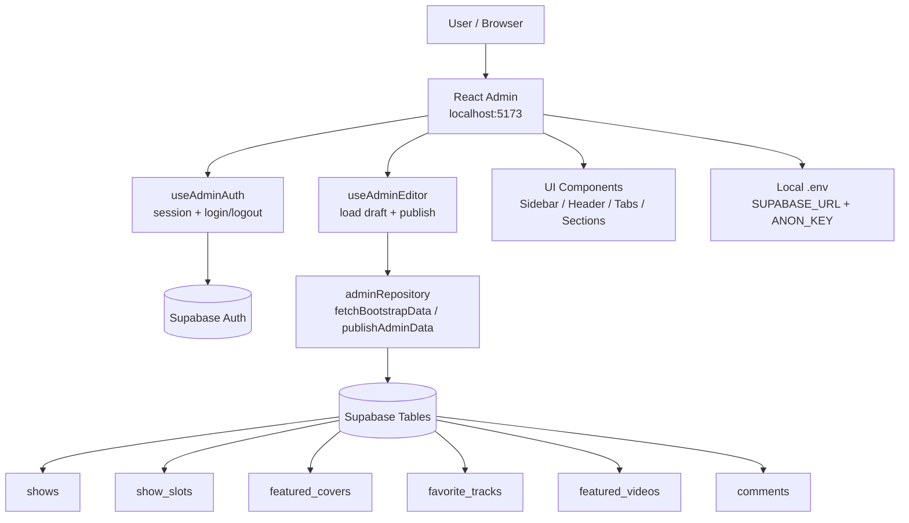

# Admin React

Ce dossier contient la version React-only de la page admin, connectee directement a Supabase (sans serveur PHP local).

## Lancer en local

Depuis la racine du repo, tu peux lancer sans te placer dans ce dossier:

```bash
npm run admin:install
npm run dev
```

Sinon en mode direct:

```bash
cd apps/admin
npm install
cp .env.example .env
# remplir VITE_SUPABASE_URL et VITE_SUPABASE_ANON_KEY
npm run dev
```

Connexion:
- utilise un compte Supabase Auth (email/password)
- ce compte doit avoir les permissions RLS pour modifier les tables admin
- le bucket Storage `admin-media` doit exister et autoriser les uploads pour les users `authenticated`

## Build production

```bash
npm run build
npm run preview
```

## Note

Le bouton `Publish` envoie toutes les modifications directement a Supabase.
Ne jamais exposer une `service_role_key` dans ce frontend.

Les uploads de covers, covers vinyl et MP3 passent par Supabase Storage dans le bucket `admin-media`, puis l'URL publique est sauvegardee dans la table concernnee.

